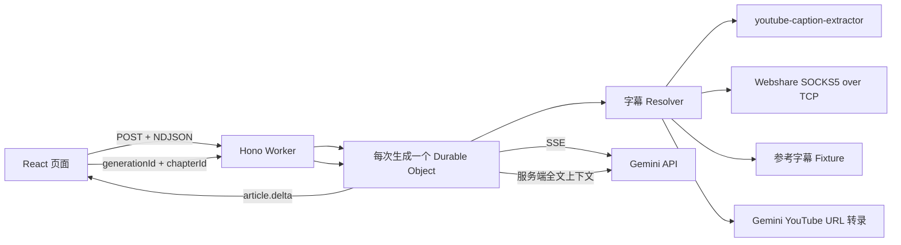

# 逐章 · YouTube 对话文章生成器

把带字幕的 YouTube 视频整理为中文对话文章。Gemini 在生成过程中持续输出正文；文章完成后，任意章节都可以基于服务端保存的完整上下文生成结构化 5W1H。

## 提交信息

| 提交物 | 地址或说明 |
| --- | --- |
| GitHub 仓库 | [github.com/jay88159/youtube-dialogue-studio](https://github.com/jay88159/youtube-dialogue-studio) |
| 公开访问网址 | [youtube-dialogue-studio.delightful-lock.workers.dev](https://youtube-dialogue-studio.delightful-lock.workers.dev) |
| 参考视频 | [Marc Andreessen: The $10 Trillion AI Revolution](https://www.youtube.com/watch?v=xRh2sVcNXQ8) |
| 技术栈 | Node.js 22、TypeScript、React 19、Hono、Cloudflare Workers、Durable Objects、Gemini API |
| 默认模型 | `gemini-3.5-flash`，通过环境变量配置 |

项目使用 Gemini API 与 Cloudflare Workers 的免费额度。当前 Gemini 3.5 Flash 标准模式的免费层输入和输出均为免费，Cloudflare 免费计划支持 SQLite-backed Durable Objects；两者均受各自配额限制，超额请求不会由应用自动切换到付费资源。限制以 [Gemini API pricing](https://ai.google.dev/gemini-api/docs/pricing) 和 [Durable Objects pricing](https://developers.cloudflare.com/durable-objects/platform/pricing/) 为准。

## 三分钟快速验收

1. 打开[线上演示](https://youtube-dialogue-studio.delightful-lock.workers.dev)，点击 **使用示例**。
2. 可选填写生成要求，点击 **生成对话文章**。字幕就绪后，右侧正文会在模型完成前持续增长。
3. 等待生成完成，点击任意章节标题旁的 **5W1H**。页面固定渲染 Who、What、When、Where、Why、How。

参考视频配置了版本化完整字幕，页面会明确显示 **演示字幕**。这条路径用于避免 YouTube 验证码影响面试验收，同时仍会调用 Gemini 真实生成文章和 5W1H。


## 评审导航

- [如何获取和处理 YouTube 字幕](#如何获取和处理-youtube-字幕)
- [如何调用 Gemini 并实现流式输出](#如何调用-gemini-并实现流式输出)
- [用户生成要求如何影响结果](#用户生成要求如何影响结果)
- [章节级 5W1H 如何实现](#章节级-5w1h-如何实现)
- [主要工程取舍和亮点](#主要工程取舍和亮点)

## 端到端架构



一个 Cloudflare Worker 同时承载静态页面、API 和 SQLite-backed Durable Object。每次生成对应一个隔离的 Durable Object，字幕、文章、章节与 5W1H 缓存保留 24 小时，到期后由 Alarm 执行 `deleteAll()`。

状态机、安全边界与失败路径见 [架构设计](docs/ARCHITECTURE.md)，两天实施范围见 [实施计划](docs/IMPLEMENTATION_PLAN.md)，生产与浏览器证据见 [验证记录](docs/VERIFICATION.md)。

## 如何获取和处理 YouTube 字幕

字幕获取分为传输层和语义解析层，Resolver 按以下顺序处理：

1. `YouTubeTranscriptProvider` 使用 `youtube-caption-extractor`，依次尝试 iOS、Android VR 和 MWEB InnerTube 客户端。它选择人工字幕、自动字幕或首个可用轨道，并解析 JSON3 时间片段。
2. 直连出现 `LOGIN_REQUIRED`、403、429 或网络错误时，如果服务端配置了 Webshare，`TcpProxyTransport` 会使用 Cloudflare `connect()` 建立 SOCKS5 隧道，再通过 `startTls()` 转发 InnerTube 与字幕请求。
3. 实时链路仍失败且视频 ID 为参考视频时，Resolver 返回版本化字幕 Fixture。Fixture 包含 2801 个英文时间片段，覆盖约 81 分钟，页面会标记来源。
4. 其他公开视频进入 Gemini YouTube URL 兜底，生成覆盖全片的结构化内容地图。页面将来源标记为 **AI 视频转录**，不会冒充 YouTube 原始字幕。
5. 私有、未列出、超过服务端边界或无法处理的视频返回明确错误。

Gemini 转录标准请求最多返回 96 个片段、每段 240 字。响应达到 token 上限或 JSON 截断时，服务端使用 48 个片段、每段 180 字的紧凑 Schema 重试一次。模型输出仍需经过运行时截断与等距采样，避免外部输出越过服务端边界。

Cloudflare Worker Fetch 没有通用代理参数，因此代理路径直接使用官方 [TCP Sockets API](https://developers.cloudflare.com/workers/runtime-apis/tcp-sockets/)。Gemini YouTube URL 输入目前处于 Preview，官方说明该能力当前免费，免费层每天最多处理 8 小时公开视频，定价和限制可能变化；因此它只承担最后兜底。详见 [Video understanding](https://ai.google.dev/gemini-api/docs/video-understanding)。

相关实现：

- `src/worker/transcript/resolver.ts`
- `src/worker/transcript/youtube.ts`
- `src/worker/transcript/tcp-proxy-transport.ts`
- `src/worker/transcript/socks5.ts`
- `src/worker/gemini/video-transcript.ts`
- `fixtures/xRh2sVcNXQ8.json`

## 如何调用 Gemini 并实现流式输出

Worker 直接调用 Gemini REST 流式接口：

```text
POST /v1beta/models/{model}:streamGenerateContent?alt=sse
```

`GeminiClient` 跨任意网络分块解析 SSE，只提取候选内容的文本增量。Durable Object 将每个增量编码为一行 NDJSON：

```json
{"type":"article.delta","text":"本次新生成的 Markdown"}
```

浏览器使用 Fetch 读取 `ReadableStream`。`decodeNdjson` 处理半行、粘包和 UTF-8 分块，`useGeneration` 收到 `article.delta` 后立即追加正文。浏览器测试通过延迟发送第二批数据，断言第一批正文已经可见，排除完整生成后模拟打字的实现。

长字幕采用两阶段渐进生成：

1. 第一阶段向 Gemini 提交视频开头 `min(5 分钟, 总时长 / 3)` 的字幕，流出模型概括的文章标题和完整开场章节。
2. 第二阶段提交完整字幕和已经展示的开场，从新的二级标题继续流式追加，覆盖中段与结尾。
3. 首批已经覆盖全部字幕的短视频自动使用单次流式请求。

两阶段方案只增加一次模型调用，并保留第二阶段的全文上下文。默认输出模型生成的一级标题；只有用户明确要求无标题、只输出正文或指定不含标题的格式时才省略标题。文章规模与章节协议见 [主文章输出协议](docs/ARTICLE_OUTPUT_CONTRACT.md)。

选择 NDJSON 是因为生成接口需要 POST JSON，而 EventSource 只能直接发起 GET；选择 Fetch 流而不是 WebSocket，是因为这条链路有限、单向并且需要取消。文章输出 Markdown，`react-markdown` 默认不执行原始 HTML。

相关实现：

- `src/worker/gemini/client.ts`
- `src/worker/gemini/sse.ts`
- `src/worker/generation-session.ts`
- `src/shared/ndjson.ts`
- `src/client/hooks/use-generation.ts`

## 用户生成要求如何影响结果

可选生成要求最长 1000 字，以独立的 `<user_requirement>` 数据块进入提示词。它可以影响：

- 任务类型，例如访谈整理、观点分析或科普复述；
- 输出风格，例如克制、叙事化、专业或口语化；
- 目标受众，例如产品经理、开发者或非技术读者；
- 约束条件，例如保留数字、控制篇幅或突出争议。

用户要求不能覆盖事实忠实度、中文 Markdown、安全指令和禁止补造事实等系统规则。字幕同样被视为不可信数据，字幕中的命令不会升级为系统指令。默认标题规则也在系统提示词中处理，普通的风格、受众和篇幅要求不会误触发无标题模式。

相关实现与测试：`src/worker/gemini/prompts.ts`、`tests/unit/gemini/prompts.test.ts`。

## 章节级 5W1H 如何实现

文章完成后，服务端按 `##` 标题建立稳定章节 ID，并在本次生成的 Durable Object 中保存：

```text
meta / transcript / article / chapters / summary:v2:{chapterId}
```

浏览器只发送章节定位信息：

```http
POST /api/generations/{generationId}/chapters/{chapterId}/5w1h
```

请求体为空，不重新提交字幕、整篇文章或当前章节。服务端从 Durable Object 读取完整字幕、全文章节标题和目标章节正文，再要求 Gemini 按 JSON Schema 返回六个必填字符串。结果经过 Zod 运行时校验并按章节缓存，重复展开不再次调用模型。

`When` 表示章节议题所处的历史时期、当前阶段、未来窗口或时间跨度，不是视频录制时间。提示词只有在全文与章节都没有阶段、先后关系或未来指向时才允许返回 **未明确**。

`tests/integration/generation-flow.test.ts` 会发送空请求体，并断言发往 Gemini 的服务端提示词包含完整字幕和当前章节，从接口层证明全文没有经由浏览器回传。

## 主要工程取舍和亮点

| 设计选择 | 工程判断 | 明确边界 |
| --- | --- | --- |
| Durable Object 保存生成上下文 | 一个生成 ID 对应一个强一致对象，文章完成后可以立即读取同一会话的字幕与章节 | 没有跨会话查询需求，不引入 D1；上下文 24 小时后删除 |
| Fetch POST + NDJSON | POST 能携带视频 URL 与生成要求，NDJSON 可以逐条解析不完整网络分块 | 单向有限流不需要 WebSocket；客户端断开会取消读取 |
| 两阶段渐进生成 | 长视频先读有限开场字幕，降低首字等待；第二阶段使用全文补齐结构 | 相比单次生成多一次模型调用；短视频自动退化为单次调用 |
| 多级字幕 Resolver | 直连、SOCKS5、Fixture、Gemini 转录形成可解释的恢复链路 | 每种来源都在页面标记，AI 转录不宣称为原始字幕 |
| JSON Schema + Zod 的 5W1H | 模型负责语义总结，Schema 固定输出形状，Zod 收口运行时边界 | 总结只在文章完成后执行，成功结果按章节缓存 |
| 有界输入输出 | URL、要求、字幕、文章、代理响应和转录片段都有明确上限 | 长视频内容地图保留首尾与关键段落，不承诺逐字复刻 |
| 免费额度优先 | 单 Worker、Static Assets、SQLite-backed Durable Objects 与 Gemini 免费层覆盖演示 | 免费额度不是无限资源，429 和外部失败会返回稳定错误 |

两天范围集中在三条可验证证据链：字幕来源可追踪、正文真实流式可见、5W1H 使用服务端上下文。账号、历史列表、富文本编辑、多模型路由和向量检索不在本次范围。

## 错误与安全边界

- 只接收常见 YouTube URL 形态并限制 URL、生成要求、字幕和文章大小。
- 无字幕、YouTube 验证、代理失败、Gemini 429 和结构化输出非法分别映射为稳定错误。
- Gemini 与 Webshare 凭据使用本地 `.dev.vars` 或 Wrangler Secret，不进入浏览器与 Git。
- 日志不输出授权头、字幕全文和完整提示词。
- 生成会话保存 24 小时后删除，控制免费存储占用。
- Webshare 完全可选；没有代理时，参考视频仍可由 Fixture 验收。

## 本地运行

环境要求：Node.js 22、pnpm 11。

```bash
pnpm install
cp .dev.vars.example .dev.vars
# 在 .dev.vars 中填写 GEMINI_API_KEY
pnpm dev
```

`.dev.vars` 已被 Git 忽略。Gemini Key 只存在于 Worker 环境，不会发送到浏览器。

## 测试与验证

```bash
pnpm lint              # ESLint
pnpm typecheck         # TypeScript strict mode
pnpm test              # 共享、字幕、Gemini、React 单元测试
pnpm test:integration  # workerd + Durable Object 集成测试
pnpm test:e2e          # Chromium 桌面与移动端完整交互
pnpm test:smoke        # 真实生产 Gemini + 5W1H，消耗免费额度
pnpm build             # Cloudflare Vite 生产构建
pnpm check             # 除真实外部 smoke 外的确定性检查
```

| 层级 | 主要证明 |
| --- | --- |
| Unit | URL 白名单、字幕轨道、验证码识别、SOCKS5 分块握手、AI 转录 Schema、SSE 与 NDJSON 分块、提示词边界、结构化输出、React 增量渲染 |
| Integration | Worker 路由、真实 Durable Object 存储、delta 早于 completed、空请求体 5W1H、服务端上下文 |
| E2E | 桌面与移动端提交、来源标记、延迟分块可见、流尾跟随、文章排版、固定六字段与输入校验 |
| Production smoke | 真实 Gemini 流、章节解析和一次 5W1H 请求 |

外部网络不进入公开 CI。真实 Gemini 与 YouTube 只用于部署后 smoke，避免第三方验证码和免费配额造成随机失败。

## 部署到 Cloudflare

```bash
pnpm exec wrangler login
pnpm exec wrangler secret put GEMINI_API_KEY

# 可选：YouTube 直连受限时配置 Webshare
pnpm exec wrangler secret put WEBSHARE_PROXY_HOST
pnpm exec wrangler secret put WEBSHARE_PROXY_PORT
pnpm exec wrangler secret put WEBSHARE_PROXY_USERNAME
pnpm exec wrangler secret put WEBSHARE_PROXY_PASSWORD

pnpm deploy
```

Vite 构建生成 Wrangler 的重定向部署配置，将 `dist/client` 作为 Static Assets 上传，并导出 SQLite-backed `GenerationSession`。可以先运行 `pnpm build` 和 `pnpm exec wrangler deploy --dry-run` 校验部署包。

## 目录与工程文档

```text
src/client              React 产品界面与流式状态
src/shared              浏览器和 Worker 共用的协议与纯函数
src/worker              Hono、Durable Object、字幕与 Gemini
fixtures                版本化参考字幕
tests/unit              快速纯函数和组件测试
tests/integration       workerd 内的 Worker 集成测试
tests/e2e               Chromium 桌面与移动用户路径
docs/ARCHITECTURE.md     架构、状态机、安全与取舍
docs/FRONTEND_DESIGN.md  编辑工作台的视觉审计与设计系统
docs/ARTICLE_OUTPUT_CONTRACT.md 主文章结构与验收协议
docs/IMPLEMENTATION_PLAN.md 两天任务拆解与完成证据
docs/VERIFICATION.md     真实 Gemini、生产流式与浏览器证据
CLAUDE.md                仓库级 AI coding 约束
```

## AI coding 说明

`CLAUDE.md` 固化了项目范围、模块依赖、Secret、Fixture 来源标记、测试优先和 Git 约束。架构文档先定义关键证据链，分层测试再验证流式传输、字幕恢复和服务端上下文。提交保持小步且可独立解释。
