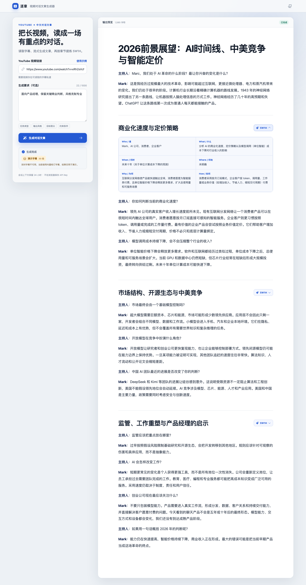
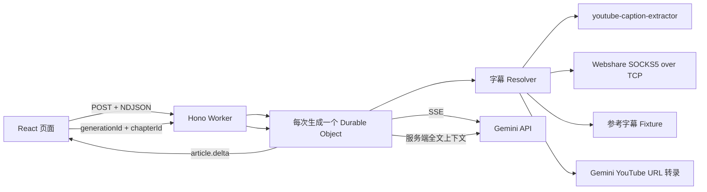

# 逐章 · YouTube 对话文章生成器

把带字幕的 YouTube 视频转换为结构清晰的中文对话文章。主文章由 Gemini 真实流式生成，完成后可以基于服务端保存的上下文，为任意章节生成固定格式的 5W1H 总结。

> GitHub：<https://github.com/jay88159/youtube-dialogue-studio>  
> 在线演示：<https://youtube-dialogue-studio.delightful-lock.workers.dev>



## 产品能力

- 输入 YouTube 链接，通过 `youtube-caption-extractor` 的 InnerTube 多客户端策略提取带时间戳字幕；仅允许固定的 YouTube 域名，避免 SSRF。
- 自然语言要求可控制任务类型、输出风格、目标受众和表达约束。
- 文章通过 POST 响应中的 NDJSON 持续抵达，生成未结束时正文已经可读，页面会跟随最新输出位置。
- 每个二级章节都有 5W1H 操作，固定渲染 Who、What、When、Where、Why、How。
- 5W1H 的浏览器请求没有请求体；完整字幕、文章结构与章节正文从 Durable Object 读取。
- YouTube 直连失败时可经 Webshare SOCKS5 代理重试；参考视频另有明确标记的内置字幕，保证演示可复现。
- 非参考视频的实时字幕和代理都失败时，可由 Gemini 直接读取公开 YouTube URL 并生成结构化转录；页面明确标记为「AI 视频转录」，不冒充原始字幕。
- 一个 Cloudflare Worker 同时承载静态页面、API 和 SQLite-backed Durable Object，不依赖付费数据库。

## 快速体验

环境要求：Node.js 22、pnpm 11。

```bash
pnpm install
cp .dev.vars.example .dev.vars
# 在 .dev.vars 中填写 GEMINI_API_KEY
pnpm dev
```

打开终端给出的本地地址，点击「使用示例」即可填入参考视频：

```text
https://www.youtube.com/watch?v=xRh2sVcNXQ8
```

`.dev.vars` 已被 Git 忽略。Gemini Key 只存在于 Worker 环境，永远不会发送到浏览器。

## 架构



选择 Durable Object 的原因不是“为了用 Cloudflare 功能”，而是题目需要生成结束后立即读取同一次会话的字幕、文章和章节。一个生成 ID 对应一个对象，天然提供强一致、隔离的上下文；24 小时 Alarm 到期后执行 `deleteAll()`。D1 的跨会话查询并无需求，KV 的最终一致性则会制造刚生成完却读不到章节的竞态。

更完整的状态机、安全边界与取舍见 [docs/ARCHITECTURE.md](docs/ARCHITECTURE.md)，两天实施拆解见 [docs/IMPLEMENTATION_PLAN.md](docs/IMPLEMENTATION_PLAN.md)，真实外部服务与浏览器证据见 [docs/VERIFICATION.md](docs/VERIFICATION.md)。

## 如何获取和处理 YouTube 字幕

字幕链路被拆成“传输”和“语义解析”两层：

1. `YouTubeTranscriptProvider` 使用 `youtube-caption-extractor`，依次尝试 iOS、Android VR 和 MWEB InnerTube 客户端，选择人工字幕、自动字幕或首个可用字幕轨道，并读取 JSON3 时间片段。
2. 库的自定义 `fetch` 由项目传输层注入。直连使用 Worker Fetch；出现 `LOGIN_REQUIRED`、403、429 或网络问题且配置了 Webshare 时，`TcpProxyTransport` 使用 Cloudflare `connect()` 建立 SOCKS5 隧道，再通过 `startTls()` 转发 InnerTube POST 和字幕 GET。
3. 如果实时链路仍失败且视频 ID 是参考视频，Resolver 使用版本化完整字幕 Fixture。
4. 其他公开视频由 Gemini YouTube URL 能力提取覆盖全片的结构化内容地图，来源标记为「AI 视频转录」。标准请求限制为 96 个片段、每段 240 字；若响应达到 token 上限或 JSON 被截断，服务端会自动改用 48 个片段、每段 180 字的紧凑 Schema 重试一次。模型偶尔会忽略 Schema 的长度提示，因此服务端还会确定性截断超长文本，并在片段过多时等距保留首尾内容。它不是 YouTube 原始字幕，页面会提示可能存在转录误差。
5. 私有、未列出、超出免费限制或无法处理的视频返回明确错误，不伪装成成功。

Fixture 带有来源说明，页面会显示黄色「演示字幕」标记。它由 `pnpm fixture:update` 使用同一字幕库从参考视频字幕轨道生成，包含 2801 个英文时间片段并覆盖约 81 分钟；它是版本化快照，不冒充本次实时提取结果。

相关实现：

- `src/worker/transcript/resolver.ts`
- `src/worker/transcript/youtube.ts`
- `src/worker/transcript/tcp-proxy-transport.ts`
- `src/worker/transcript/socks5.ts`
- `src/worker/gemini/video-transcript.ts`
- `fixtures/xRh2sVcNXQ8.json`
- `scripts/update-reference-transcript.mjs`

Cloudflare Worker 的 `fetch` 没有通用 `proxy` 参数，因此代理路径直接使用官方 [TCP Sockets API](https://developers.cloudflare.com/workers/runtime-apis/tcp-sockets/)。

Gemini 的 YouTube URL 输入目前处于 Preview，官方说明免费提供、免费层每天最多处理 8 小时公开视频，价格与限制未来可能变化；因此它是最后兜底而不是唯一字幕方案。详见官方 [Video understanding](https://ai.google.dev/gemini-api/docs/generate-content/video-understanding)。

内容地图的上限是有意的工程取舍：文章需要覆盖观点、人物、数字和分歧，而不需要复制每一句口头语。相比无限制要求“完整逐字稿”，有界 Schema 能控制免费额度消耗，并避免长视频在 JSON 字符串中途被截断。Schema 是对模型的输出约束，不是服务端信任边界；最终边界始终由运行时代码收口。

## 如何调用 Gemini 并实现流式输出

Worker 直接调用 Gemini REST 接口：

```text
POST /v1beta/models/{model}:streamGenerateContent?alt=sse
```

`GeminiClient` 跨任意网络分块解析 SSE，只提取候选内容中的文本增量。Durable Object 把每个增量编码成一行 NDJSON：

```json
{"type":"article.delta","text":"本次新生成的 Markdown"}
```

浏览器通过 Fetch 读取 `ReadableStream`，`decodeNdjson` 处理半行、粘包和 UTF-8 分块，`useGeneration` 每收到一个 `article.delta` 就追加正文，生成期间视口跟随流尾。这里没有把完整结果攒完再模拟打字；延迟分块浏览器测试会断言第一批正文在第二批和完成事件之前可见。

为了降低长字幕的首字等待，主文章使用两阶段渐进生成。第一阶段只向 Gemini 提交视频开头 `min(5 分钟, 总时长 / 3)` 的字幕，立即流出一级标题和开场章节；读者开始阅读后，第二阶段再提交完整字幕和已展示的开场，只追加新的二级章节。相比按五分钟切成十几次请求，这个方案只增加一次模型调用，保留了全文续写所需的全局上下文，也避免每段各自生成标题和重复论点。短到首批已覆盖全部字幕时自动退化为原来的一次流式请求。

主文章遵循 [主文章输出协议](docs/ARTICLE_OUTPUT_CONTRACT.md)：长视频默认生成 8–12 个章节、6000–10000 个中文字符，每章包含副标题和多轮问答，并覆盖视频开头、中段和结尾。完整示例文章只用于提炼协议，不整篇塞入 Prompt。

选择 NDJSON 而不是 EventSource，是因为生成请求需要 POST JSON；选择 Fetch 而不是 WebSocket，是因为这是一次有限、单向、可取消的流。文章使用 Markdown 而非模型 HTML，React Markdown 默认不执行原始 HTML。

相关实现：

- `src/worker/gemini/client.ts`
- `src/worker/gemini/sse.ts`
- `src/worker/generation-session.ts`
- `src/shared/ndjson.ts`
- `src/client/hooks/use-generation.ts`

Gemini 文本流与结构化输出的接口形态参考官方 [文本生成](https://ai.google.dev/gemini-api/docs/generate-content/text-generation) 和 [结构化输出](https://ai.google.dev/gemini-api/docs/structured-output) 文档。模型名通过 `GEMINI_MODEL` 配置，不写死在业务模块中。Gemini 3.5 Flash 请求使用 `thinkingLevel: "low"`，并遵循该代模型的建议，不覆盖 temperature、topP 或 topK；这样把免费额度优先用于正文，同时避免过时的采样参数造成不可预测行为。

## 用户生成要求如何影响结果

可选要求最长 1000 字，作为独立的“不可信用户偏好”数据块进入提示词。系统提示词允许它影响：

- 任务类型，例如访谈整理、观点分析或科普复述；
- 输出风格，例如克制、叙事化、专业或口语化；
- 目标受众，例如产品经理、开发者或非技术读者；
- 约束条件，例如保留数字、控制篇幅或突出争议。

它不能覆盖事实忠实度、中文 Markdown 协议、安全指令和“不补造字幕之外事实”的底线。字幕本身同样被视为不可信数据，字幕里出现的命令不会升级为系统指令。

相关实现与测试：`src/worker/gemini/prompts.ts`、`tests/unit/gemini/prompts.test.ts`。

## 章节级 5W1H 如何实现

文章生成完成后，服务端按 `##` 标题建立稳定章节 ID，并在同一个 Durable Object 中保存：

```text
meta / transcript / article / chapters / summary:{chapterId}
```

浏览器只发送：

```http
POST /api/generations/{generationId}/chapters/{chapterId}/5w1h
```

请求不包含字幕、整篇文章或当前章节正文。服务端读取完整字幕、全文章节标题和目标章节正文，要求 Gemini 按 JSON Schema 返回六个必填字符串，再用 Zod 做运行时校验。成功结果按章节缓存，重复展开不再次消耗免费额度。

这条约束由 `tests/integration/generation-flow.test.ts` 验证：测试发送空请求体，并检查发往 Gemini 的服务端提示词同时包含完整字幕和当前章节。

## 错误、配额与工程边界

- 输入：只接收常见 YouTube URL 形态，要求长度、字幕大小和文章大小均有限制。
- 外部失败：无字幕、YouTube 验证、代理失败、Gemini 429 与结构化输出非法分别映射为稳定错误。
- Secret：Gemini 与 Webshare 凭据使用本地 `.dev.vars` 或 Wrangler Secret；日志不输出请求头、字幕和提示词。
- 生命周期：会话 24 小时后删除，控制 Durable Object 免费存储占用。
- 免费资源：单 Worker、Static Assets、Durable Objects；不使用 D1、KV、Queue、Vectorize 等额外资源。免费额度与限制以 Cloudflare 官方 [Durable Objects 计费](https://developers.cloudflare.com/durable-objects/platform/pricing/) 和 [Workers Limits](https://developers.cloudflare.com/workers/platform/limits/) 为准。
- 代理：Webshare 完全可选。没有代理时，参考视频仍可通过 Fixture 演示；其他公开且可处理的视频进入明确标记的 Gemini 视频转录兜底。

两天范围有意不做账号、历史列表、富文本编辑、多模型路由和向量检索。这些能力会增加代码量，却不会加强题目的核心证据链：真实流式、字幕韧性和服务端上下文总结。

## 测试与验证

```bash
pnpm lint              # ESLint
pnpm typecheck         # TypeScript strict mode
pnpm test              # 共享、字幕、Gemini、React 单元测试
pnpm test:integration  # workerd + Durable Object 集成测试
pnpm test:e2e          # Chromium 桌面与移动端完整交互
pnpm test:smoke        # 真实生产 Gemini + 5W1H（消耗免费额度）
pnpm build             # Cloudflare Vite 生产构建
pnpm check             # 除真实外部 smoke 外的确定性检查
```

测试分层：

| 层级 | 主要证明 |
| --- | --- |
| Unit | URL 白名单、字幕轨道、验证码识别、SOCKS5 任意分块握手、AI 转录 Schema、SSE/NDJSON 任意分块、提示词边界、结构化输出、React 增量渲染 |
| Integration | Worker 路由、真实 Durable Object 存储、delta 早于 completed、空请求体 5W1H、服务端上下文 |
| E2E | 桌面和移动页面的提交、来源标记、延迟分块可见与流尾跟随、文章排版、章节按钮、固定六字段与输入校验 |

外部网络不会进入公开 CI。实时 Gemini 与 YouTube 只做部署后的 smoke test，避免第三方验证码和免费配额让单元测试随机失败。

## 部署到 Cloudflare

先登录并创建免费计划下的 Worker：

```bash
pnpm exec wrangler login
pnpm exec wrangler secret put GEMINI_API_KEY

# 可选：YouTube 直连受限时配置 Webshare
pnpm exec wrangler secret put WEBSHARE_PROXY_HOST
pnpm exec wrangler secret put WEBSHARE_PROXY_PORT
pnpm exec wrangler secret put WEBSHARE_PROXY_USERNAME
pnpm exec wrangler secret put WEBSHARE_PROXY_PASSWORD

pnpm deploy
```

Vite 构建会生成 Wrangler 的重定向部署配置，把 `dist/client` 作为 Static Assets 上传，并导出 SQLite-backed `GenerationSession`。可先用下面的命令校验部署包而不发布：

```bash
pnpm build
pnpm exec wrangler deploy --dry-run
```

部署完成后，使用参考视频做一次真实 smoke test，并确认页面出现正文增量、字幕来源与 5W1H 六字段。

## 目录

```text
src/client              React 产品界面与流式状态
src/shared              浏览器和 Worker 共用的协议与纯函数
src/worker              Hono、Durable Object、字幕与 Gemini
fixtures                版本化参考字幕
tests/unit              快速纯函数和组件测试
tests/integration       workerd 内的 Worker 集成测试
tests/e2e               Chromium 桌面与移动用户路径
docs/ARCHITECTURE.md     架构、状态机、安全与取舍
docs/FRONTEND_DESIGN.md  编辑工作台的视觉审计与设计系统
docs/ARTICLE_OUTPUT_CONTRACT.md 主文章结构、规模与参考视频验收协议
docs/IMPLEMENTATION_PLAN.md 两天任务拆解与完成证据
docs/VERIFICATION.md     真实 Gemini、生产流式与浏览器证据
CLAUDE.md                仓库级 AI coding 约束
```

## AI coding 说明

仓库允许 AI 辅助，但不把生成代码本身当作工程质量。`CLAUDE.md` 固化了范围、模块依赖、Secret、Fixture 诚实标记、测试优先和 Git 约束；架构文档先定义证据链，再由分层测试证明关键行为。提交保持小步且可独立解释，分支和提交信息不包含题目禁止的词汇。
